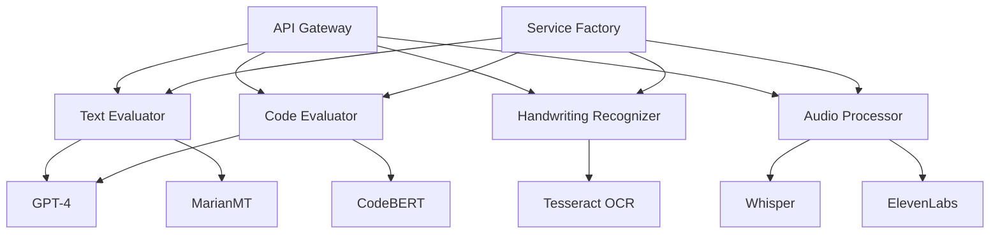

# VidyAI AI Services Documentation

## Overview

VidyAI's AI services are built as microservices using Python, providing various AI capabilities for evaluating student submissions, generating feedback, and supporting multiple languages.

## Architecture



## Services

### Text Evaluator

Handles evaluation of text submissions using advanced NLP techniques.

#### Features
- Content evaluation using GPT-4
- Multi-language support via MarianMT
- Contextual feedback generation
- Confidence scoring
- Explanation generation using LIME

#### Configuration
```python
TEXT_EVALUATOR_CONFIG = {
    "max_length": 5000,
    "supported_languages": ["en", "ta", "hi", "te"],
    "min_confidence": 0.7,
    "feedback_types": ["detailed", "summary", "points"]
}
```

### Code Evaluator

Analyzes and evaluates code submissions across multiple programming languages.

#### Features
- Syntax analysis
- Code quality metrics
- Best practices checking
- Security vulnerability detection
- Performance optimization suggestions

#### Supported Languages
- Python
- JavaScript/TypeScript
- Java
- C++
- SQL

#### Metrics
```python
CODE_METRICS = {
    "complexity": {
        "cyclomatic": "number",
        "cognitive": "number"
    },
    "maintainability": {
        "score": "number",
        "issues": "array"
    },
    "performance": {
        "time_complexity": "string",
        "space_complexity": "string"
    },
    "security": {
        "vulnerabilities": "array",
        "risk_score": "number"
    }
}
```

### Handwriting Recognizer

Processes and recognizes handwritten submissions using advanced OCR.

#### Features
- Image preprocessing
- Text extraction
- Mathematical expression recognition
- Chemical formula recognition
- Confidence scoring

#### Image Processing Pipeline
1. Grayscale conversion
2. Noise reduction
3. Contrast enhancement
4. Deskewing
5. Character segmentation
6. Recognition

#### Subject-Specific Processing
```python
SUBJECT_PROCESSORS = {
    "mathematics": {
        "symbol_recognition": True,
        "equation_parsing": True,
        "graph_detection": True
    },
    "chemistry": {
        "formula_recognition": True,
        "structure_detection": True
    },
    "physics": {
        "diagram_recognition": True,
        "unit_conversion": True
    }
}
```

### Audio Processor

Handles voice submissions and generates audio feedback.

#### Features
- Speech-to-text transcription
- Multi-language support
- Audio feedback generation
- Voice quality assessment
- Pronunciation scoring

#### Audio Processing Pipeline
1. Audio normalization
2. Noise reduction
3. Speech recognition
4. Language detection
5. Text processing
6. Audio synthesis

#### Configuration
```python
AUDIO_PROCESSOR_CONFIG = {
    "max_duration": 600,  # seconds
    "sample_rate": 16000,
    "channels": 1,
    "format": "wav",
    "supported_languages": ["en", "ta", "hi", "te"],
    "voice_options": {
        "en": ["male", "female", "child"],
        "ta": ["male", "female"],
        "hi": ["male", "female"],
        "te": ["male", "female"]
    }
}
```

## Integration

### Service Factory

The Service Factory pattern is used to manage and initialize AI services:

```python
from service_factory import ServiceFactory

# Initialize services
factory = ServiceFactory()

# Get service instance
text_evaluator = factory.get_service('text')

# Evaluate submission
result = text_evaluator.evaluate({
    "content": "submission text",
    "language": "en",
    "subject": "english"
})
```

### Error Handling

```python
class AIServiceError(Exception):
    def __init__(self, service, error_type, message, details=None):
        self.service = service
        self.error_type = error_type
        self.message = message
        self.details = details or {}
        super().__init__(self.message)

# Error types
ERROR_TYPES = {
    "INITIALIZATION": "Service initialization failed",
    "PROCESSING": "Processing error",
    "VALIDATION": "Input validation failed",
    "TIMEOUT": "Processing timeout",
    "API": "External API error"
}
```

## Monitoring

### Metrics

```python
METRICS = {
    "processing_time": "histogram",
    "success_rate": "gauge",
    "error_count": "counter",
    "queue_size": "gauge",
    "api_latency": "histogram",
    "memory_usage": "gauge",
    "gpu_usage": "gauge"
}
```

### Health Checks

```python
async def health_check():
    return {
        "status": "healthy",
        "services": {
            "text_evaluator": await check_text_evaluator(),
            "code_evaluator": await check_code_evaluator(),
            "handwriting_recognizer": await check_handwriting_recognizer(),
            "audio_processor": await check_audio_processor()
        },
        "external_apis": {
            "gpt4": await check_gpt4(),
            "elevenlabs": await check_elevenlabs()
        },
        "resources": {
            "memory": get_memory_usage(),
            "gpu": get_gpu_usage()
        }
    }
```

## Deployment

### Requirements

- Python 3.9+
- CUDA-compatible GPU (recommended)
- 16GB+ RAM
- 100GB+ storage

### Environment Variables

```env
# API Keys
OPENAI_API_KEY=your_openai_key
ELEVEN_LABS_API_KEY=your_elevenlabs_key

# Service Configuration
MAX_BATCH_SIZE=32
PROCESSING_TIMEOUT=300
MEMORY_LIMIT=8192
GPU_MEMORY_LIMIT=4096

# Monitoring
PROMETHEUS_PORT=9090
METRICS_ENABLED=true

# Logging
LOG_LEVEL=INFO
LOG_FORMAT=json
```

### Docker Deployment

```dockerfile
FROM nvidia/cuda:11.8.0-runtime-ubuntu22.04

WORKDIR /app

COPY requirements.txt .
RUN pip install -r requirements.txt

COPY . .

CMD ["uvicorn", "main:app", "--host", "0.0.0.0", "--port", "5000"]
```